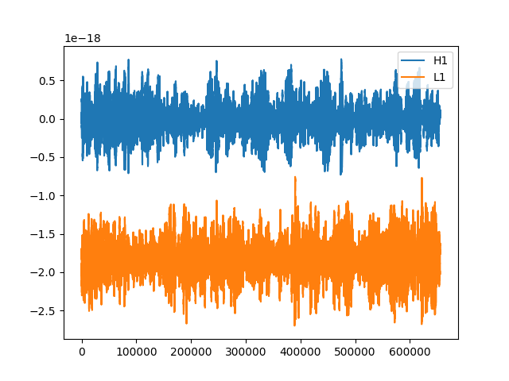
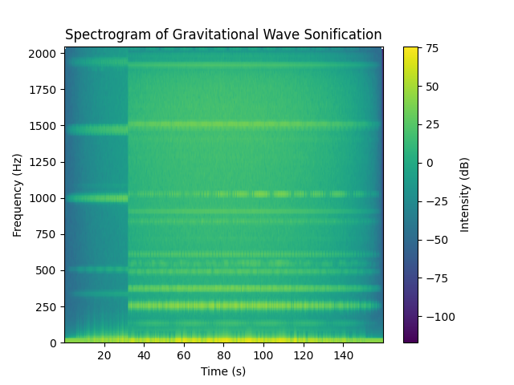

# Gravitational Wave Sonification


This repository contains code for sonifying gravitational wave data, turning it into an audio representation that can be listened to. Gravitational waves are ripples in spacetime caused by the acceleration of massive objects, such as colliding black holes or neutron stars. Sonification provides an alternative way to experience and explore these fascinating astronomical events, offering a unique auditory perspective on the universe.



### Sonification with sampling rate of 44100 Hz (standard)

<iframe width="560" height="315" src="https://www.youtube-nocookie.com/embed/VLNdrMwfYcA" title="YouTube video player" frameborder="0" allow="accelerometer; autoplay; clipboard-write; encrypted-media; gyroscope; picture-in-picture; web-share" allowfullscreen></iframe>

### Sonification with sampling rate of 4096 Hz (Original sampling rate of data)

<iframe width="560" height="315" src="https://www.youtube-nocookie.com/embed/sA622n7dgHU" title="YouTube video player" frameborder="0" allow="accelerometer; autoplay; clipboard-write; encrypted-media; gyroscope; picture-in-picture; web-share" allowfullscreen></iframe>

## Dependencies

This project relies on the following Python libraries:
- NumPy
- SciPy
- Matplotlib

You can install these dependencies using pip:
```
pip install numpy scipy matplotlib
```

## Usage

1. Clone this repository to your local machine:
   ```bash
   git clone https://github.com/your-username/gravitational-wave-sonification.git
   ```

2. Place your gravitational wave data in the repository `data` directory with the filename `sep_data.npy`.

3. Modify the code as needed:
   - Adjust the `low_freq` and `high_freq` variables to control the frequency range to be sonified.
   - Change the `duration_factor` to extend or shorten the audio duration.

4. Run the script:
   ```bash
   python gravitational_wave_sonification.py
   ```

5. After running the script, an audio file named `gravity.wav` will be generated, containing the sonified gravitational wave data. The spectrogram will be saved as `spectrogram.png`.

## Contributions

Contributions to this project are welcome! If you have any ideas for improvements or new features, feel free to open an issue or submit a pull request. Make sure to adhere to the project's coding style and documentation conventions.
